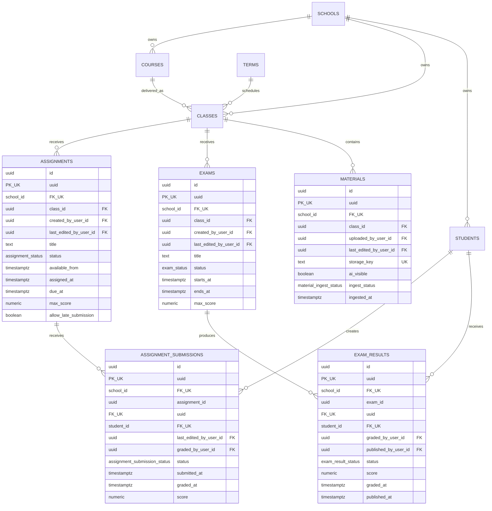

# Assessment and content data model

ST-039 adds class-scoped assignments, submissions, exams, result placeholders, and educational
materials. Every new entity is school-owned, uses composite tenant-safe references, and has forced
canonical RLS.

`ASSIGNMENT_SUBMISSIONS` is unique by `(school_id, assignment_id, student_id)` and `EXAM_RESULTS`
is unique by `(school_id, exam_id, student_id)`. These candidate keys permit one current row per
student/assessment; multiple attempts are not modeled. Each FK shown between school-owned entities
also includes `school_id`, even where Mermaid displays the relationship compactly.

Materials belong to one class and reference permanent object storage; file bytes remain outside
PostgreSQL. `ai_visible` defaults to false and does not replace authorization. Ingestion supports
only `uploaded`, `processing`, `ready`, and `failed`. Assignment/exam material junctions, submission
attachments, file-object normalization, AI chunks, and embeddings are future models.

All five tables are owned by `studafy_admin`, grant controlled CRUD to `studafy_app`, and have RLS
enabled and forced with `tenant_isolation`. Application permission checks still decide who may
create, submit, grade, publish, upload, or expose material to AI.
