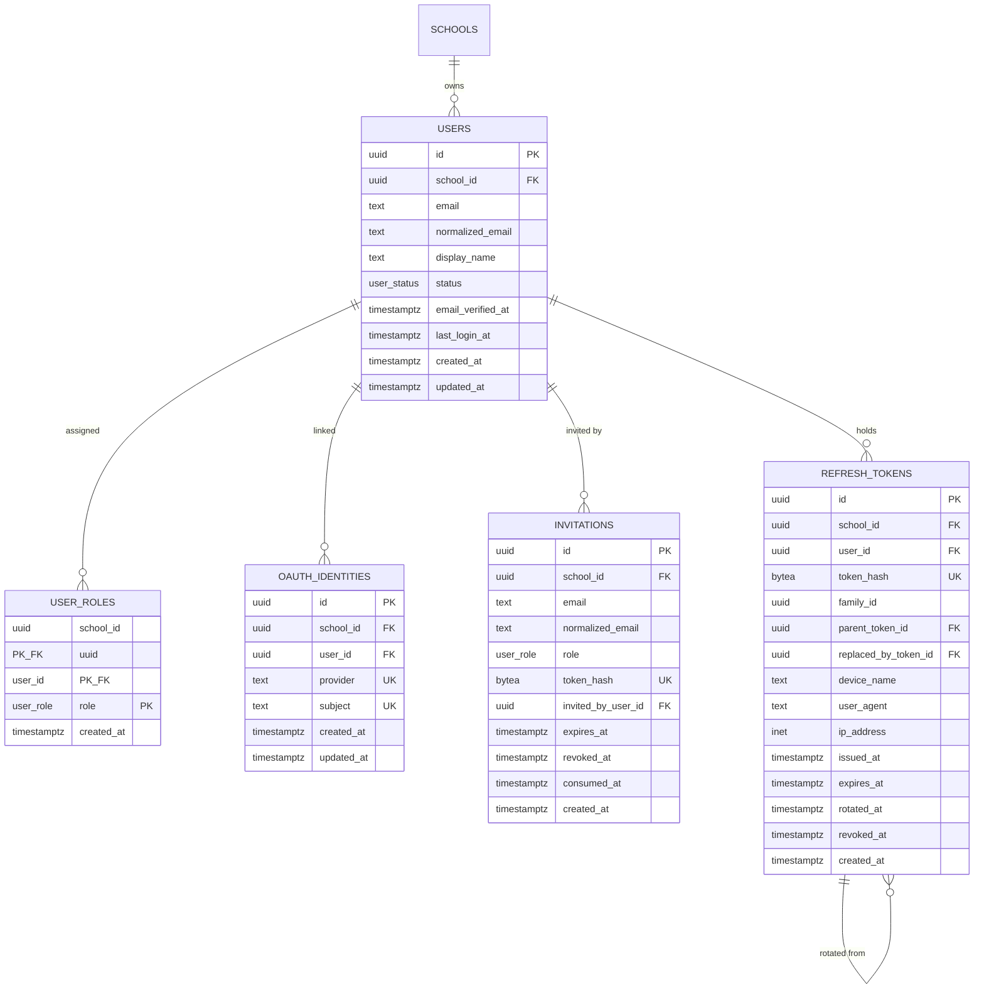

# Authentication data model

Student, teacher, and guardian relationship extensions are documented in
[`profile-data-model.md`](./profile-data-model.md).

The authentication and identity tables are the first **tenant-scoped** tables in the `app`
schema. Unlike the global data (`docs/api/global-data-erd.md`), every table here carries a
canonical `school_id`, references `app.schools(id)`, and runs under the canonical
`tenant_isolation` Row-Level Security policy (RLS enabled **and** forced, fail-closed on a
missing or invalid `app.school_id`). Roles are the fixed set from `@studafy/constants`
(ADR-0002); token, OAuth, and RLS decisions are recorded in
`docs/adr/0006-identity-tokens-and-tenant-rls.md`.



## Scope and table classification

| Table              | Purpose                                                | Tenant       | Key relationships                                                   |
| ------------------ | ------------------------------------------------------ | ------------ | ------------------------------------------------------------------- |
| `users`            | Canonical school-scoped account                        | school-owned | → `schools(id)`; parent of the other four                           |
| `user_roles`       | User↔role assignments (junction)                       | school-owned | → `schools`, → `users(id, school_id)`                               |
| `oauth_identities` | External IdP accounts                                  | school-owned | → `schools`, → `users(id, school_id)`; global `(provider, subject)` |
| `invitations`      | Pending invitations, hash-only token                   | school-owned | → `schools`, inviter → `users(id, school_id)`                       |
| `refresh_tokens`   | Revocable refresh tokens, hash-only, rotation families | school-owned | → `schools`, → `users(id, school_id)`, self → `(id, school_id)`     |

## `users` lifecycle

`status` is the enum `app.user_status = ('invited', 'active', 'suspended', 'archived')`,
default `invited`, `archived` terminal (mirrors `app.school_status`). Transitions are
application-enforced (no triggers): `invited → active`, `active ↔ suspended`, and any state
`→ archived`. `email` preserves the display form; `normalized_email = lower(btrim(email))` is
the canonical form used for lookup and uniqueness. `email_verified_at` and `last_login_at` are
observational timestamps. Uniqueness is **tenant-scoped** (`UNIQUE (school_id,
normalized_email)`) — the same person may hold an account in more than one school.

## Role-assignment model

`user_roles` is a pure junction table with natural primary key `(school_id, user_id, role)`;
`role` is `app.user_role`, the seven fixed values from `@studafy/constants` (`SUPER_ADMIN`,
`ORG_ADMIN`, `INSTRUCTOR`, `TEACHING_ASSISTANT`, `STUDENT`, `GUEST`, `SUPPORT_AGENT`). A role is
assigned at most once per user; there are no role arrays, CSV, or JSONB. The composite foreign
key `(user_id, school_id) → users(id, school_id)` guarantees an assignment stays within the
user's own school. Row-level scoping and permission checks remain application responsibilities
(ADR-0002) — RLS only guards the tenant boundary.

## OAuth identity model

`oauth_identities` stores external accounts separately from `users`. `UNIQUE (provider,
subject)` is **global**, not tenant-scoped, because an IdP subject identifies exactly one
external account across the whole platform; the composite foreign key still binds the row to
one school. Only `provider` (lowercase slug) and `subject` are stored — never provider access
tokens, refresh tokens, raw ID tokens, or duplicated profile data. **OAuth email is not the
stable identity**; email may change at the provider, so account linking keys on `(provider,
subject)` and any email-based linking is a deliberate application-layer process.

## Invitation lifecycle and token-hash strategy

`invitations` records a pending invite with lifecycle timestamps `expires_at` (required),
`revoked_at`, `consumed_at`. Constraints compare stored columns only: `expires_at >
created_at`; `revoked_at`/`consumed_at ≥ created_at` when set; an invite cannot be **both**
revoked and consumed. A partial unique index enforces **at most one active** invitation per
`(school_id, normalized_email, role)` where `revoked_at IS NULL AND consumed_at IS NULL`.
Expiry deliberately does **not** appear in the predicate (a mutable-time predicate is not
immutable and is invalid in an index) — whether an active invitation is currently expired is
checked in the accepting transaction.

The invitation token is stored **only** as `token_hash bytea` (32-byte digest, unique). The
raw token is high-entropy random, generated and returned once by the application, and never
persisted, logged, or returned by an API.

## Refresh-token lifecycle and token-family model

`refresh_tokens` are revocable server-side records, stored hash-only (`token_hash bytea`, 32
bytes, unique). `family_id` groups a rotation chain so an entire family can be revoked on reuse
detection; `parent_token_id` and `replaced_by_token_id` trace the chain and are constrained to
the same school by composite self foreign keys against `(id, school_id)`. Lifecycle constraints
compare stored columns only: `expires_at > issued_at`; `rotated_at`/`revoked_at ≥ issued_at`
when set; a token cannot be its own parent or replacement. Expiry is evaluated during
authentication, not by a constraint. Reuse detection (presenting an already-rotated token) is
an application flow that revokes the `family_id`.

That flow now exists (ST-071) and is described in
[SAD 13](../architecture/SAD_13_session_model.md), which is the reference for the session
lifecycle as a whole. Three things it adds that change the picture above:

- **The wire token is `<locator>.<secret>`**, and only the secret half is hashed into
  `token_hash`. The locator is a random uuid resolved through a new _global_ relation,
  `app.refresh_token_locators`, because a refresh request has no `school_id` yet and no tenant
  transaction can open without one. The digest itself never leaves the tenant-isolated table.
  `000029` carries the full rationale, including why a `SECURITY DEFINER` function against
  `refresh_tokens` cannot serve that lookup.
- **`refresh_tokens` gained a RESTRICTIVE `refresh_tokens_owner` policy**, so rows are fenced to
  their owning user and not merely to their tenant. Callers must set `app.user_id` as well as
  `app.school_id`; `app.current_user_id()` raises on an unset GUC rather than matching nothing.
- **`channel` records the surface a session was established from**, and decides whether a rotated
  token is delivered as an `HttpOnly` cookie or in the response body.

### Device metadata policy

Device context uses explicit optional columns — `device_name`, `user_agent`, `ip_address`
(`inet`) — not a JSONB blob. These are potentially sensitive (fingerprinting/PII); they are
stored only to support session listing and revocation, are not indexed, and should be retained
only as long as the owning refresh token and purged with it.

## Tenant ownership, RLS behavior, and runtime grants

All tables, the `app.user_status`/`app.user_role` enums, indexes, and policies are owned by
`studafy_admin`; `studafy_app` owns nothing and is `NOBYPASSRLS`. Each table has the canonical
`tenant_isolation` policy applied by `app.apply_tenant_isolation`:

```sql
USING      (school_id = current_setting('app.school_id')::uuid)
WITH CHECK (school_id = current_setting('app.school_id')::uuid)
```

Missing or invalid `app.school_id` raises, so reads and writes fail closed. `PUBLIC` has no
privileges; `studafy_app` is granted `SELECT, INSERT, UPDATE, DELETE` on all five tables and
`USAGE` on both enums. **RLS is not authorization**: it isolates tenants; the application still
enforces role/action permissions via `@studafy/constants` (ADR-0002).

Verify RLS and ownership:

```sql
SELECT relname, relrowsecurity, relforcerowsecurity, pg_get_userbyid(relowner)
FROM pg_class
WHERE relnamespace = 'app'::regnamespace
  AND relname IN ('users','user_roles','oauth_identities','invitations','refresh_tokens');
```

## Normalization review

All five tables are in **3NF**.

| Table              | Primary key                  | Candidate keys                                                     | Foreign keys                                                                                                                         |
| ------------------ | ---------------------------- | ------------------------------------------------------------------ | ------------------------------------------------------------------------------------------------------------------------------------ |
| `users`            | `id`                         | `(id, school_id)`, `(school_id, normalized_email)`                 | `school_id → schools(id)`                                                                                                            |
| `user_roles`       | `(school_id, user_id, role)` | —                                                                  | `school_id → schools`, `(user_id, school_id) → users(id, school_id)`                                                                 |
| `oauth_identities` | `id`                         | `(provider, subject)`                                              | `school_id → schools`, `(user_id, school_id) → users(id, school_id)`                                                                 |
| `invitations`      | `id`                         | `token_hash`, partial `(school_id, normalized_email, role)` active | `school_id → schools`, `(invited_by_user_id, school_id) → users(id, school_id)`                                                      |
| `refresh_tokens`   | `id`                         | `(id, school_id)`, `token_hash`                                    | `school_id → schools`, `(user_id, school_id) → users`, self `(parent_token_id, school_id)`, self `(replaced_by_token_id, school_id)` |

- **1NF** — every column is atomic: no role arrays, no CSV provider ids, no concatenated device
  strings, no multiple tokens per row, no JSONB standing in for a relationship.
- **2NF** — on the only composite-key table (`user_roles`) the sole non-key column `created_at`
  depends on the whole key; all other tables have a single-column surrogate key.
- **3NF** — no transitive dependencies: OAuth/invitation/refresh state lives on its own table,
  not on `users`; `user_roles` duplicates no user attributes; no auth table copies school name
  or slug; token-family state is not duplicated across rows.
- **Composite tenant integrity** — `user_roles`, `oauth_identities`, `invitations` inviter, and
  `refresh_tokens` (user + rotation chain) all reference `(…, school_id)` candidate keys, so no
  relationship can cross a school boundary regardless of RLS.

There is **no deliberate denormalization** in this model.

## Index rationale

| Index                                   | Table              | Columns / predicate                                              | Query it serves                                  | Not redundant because                                               |
| --------------------------------------- | ------------------ | ---------------------------------------------------------------- | ------------------------------------------------ | ------------------------------------------------------------------- |
| `pk_users`                              | `users`            | `(id)`                                                           | user by id                                       | primary key                                                         |
| `uq_users_id_school`                    | `users`            | `(id, school_id)`                                                | composite-FK target                              | anchors child `(user_id, school_id)` FKs; a PK on `id` alone cannot |
| `uq_users_school_normalized_email`      | `users`            | `(school_id, normalized_email)`                                  | login by tenant + email; RLS `school_id` prefix  | different columns from the PK                                       |
| `pk_user_roles`                         | `user_roles`       | `(school_id, user_id, role)`                                     | roles for a user; authz checks; FK check         | primary key                                                         |
| `uq_oauth_identities_provider_subject`  | `oauth_identities` | `(provider, subject)`                                            | OAuth callback lookup (global)                   | unique business key                                                 |
| `idx_oauth_identities_school_user`      | `oauth_identities` | `(school_id, user_id)`                                           | a user's linked identities; FK check; RLS prefix | not covered by PK or the provider/subject key                       |
| `uq_invitations_token_hash`             | `invitations`      | `(token_hash)`                                                   | invitation acceptance by token                   | unique                                                              |
| `uq_invitations_active`                 | `invitations`      | `(school_id, normalized_email, role)` WHERE not revoked/consumed | one active invite; pending listing               | partial, distinct from token-hash key                               |
| `idx_invitations_school_invited_by`     | `invitations`      | `(school_id, invited_by_user_id)`                                | invitations by inviter; FK parent checks         | active-invitation index does not include the inviter                |
| `uq_refresh_tokens_id_school`           | `refresh_tokens`   | `(id, school_id)`                                                | self composite-FK target                         | anchors parent/replacement FKs                                      |
| `uq_refresh_tokens_token_hash`          | `refresh_tokens`   | `(token_hash)`                                                   | refresh by token                                 | unique                                                              |
| `idx_refresh_tokens_school_family`      | `refresh_tokens`   | `(school_id, family_id)`                                         | revoke an entire family                          | not covered by any key                                              |
| `idx_refresh_tokens_school_user`        | `refresh_tokens`   | `(school_id, user_id)`                                           | revoke/list a user's tokens; FK check            | not covered by any key                                              |
| `idx_refresh_tokens_school_parent`      | `refresh_tokens`   | `(school_id, parent_token_id)`                                   | child lookup; parent-token FK checks             | user/family indexes do not include the parent token                 |
| `idx_refresh_tokens_school_replaced_by` | `refresh_tokens`   | `(school_id, replaced_by_token_id)`                              | reverse rotation lookup; replacement FK checks   | user/family indexes do not include the replacement token            |

The relationship indexes deliberately include nullable FK columns without partial predicates so
PostgreSQL can use them directly for parent update/delete checks and rotation-chain traversal.
No index exists on `ip_address`, `user_agent`, or `device_name`; there is no status/role reverse
index until a listing query justifies it. The RLS predicate casts the GUC, never the column, so
`school_id`-leading indexes remain usable.

## Cleanup and retention

No cleanup jobs are introduced here. Expired/consumed invitations and expired/revoked refresh
tokens are retained until a future retention process removes them; `expires_at` supports a
future range scan if such a job is added. Token hashes must never be exposed through APIs or
logs; device metadata is purged with its refresh token.

## Security assumptions

- Raw invitation and refresh tokens are never stored, logged, or returned — only 32-byte
  `bytea` hashes of high-entropy random tokens (not password hashing).
- RLS enforces the tenant boundary; the application enforces role/action authorization.
- OAuth email is not the stable identity; linking keys on `(provider, subject)`.
- Time-based expiry is evaluated in the authenticating transaction, never in a constraint.

## Fields intentionally not included

Password hashes (authentication is an application/service boundary; no DB-side password
handling — see `docs/database/extensions.md`); provider access/refresh/ID tokens; a
database-backed roles catalog (roles are compile-time, ADR-0002); soft-delete `deleted_at`
columns (lifecycle uses the `archived` status / lifecycle timestamps instead); `oauth_identities`
`email_at_provider` / `last_login_at` and free-form device JSONB (added only when a requirement
justifies them).

## Extending this model

New tenant tables follow the same pattern: create owned by `studafy_admin`, add `school_id
uuid NOT NULL` with a single-column FK to `app.schools(id)`, expose a `(id, school_id)`
candidate key when children must reference it, grant `studafy_app` only the needed CRUD, then
call `app.apply_tenant_isolation('app', '<table>')`. Keep tokens hash-only, keep time-based
expiry out of constraints, and prefer explicit columns over JSONB for stable relational data.
