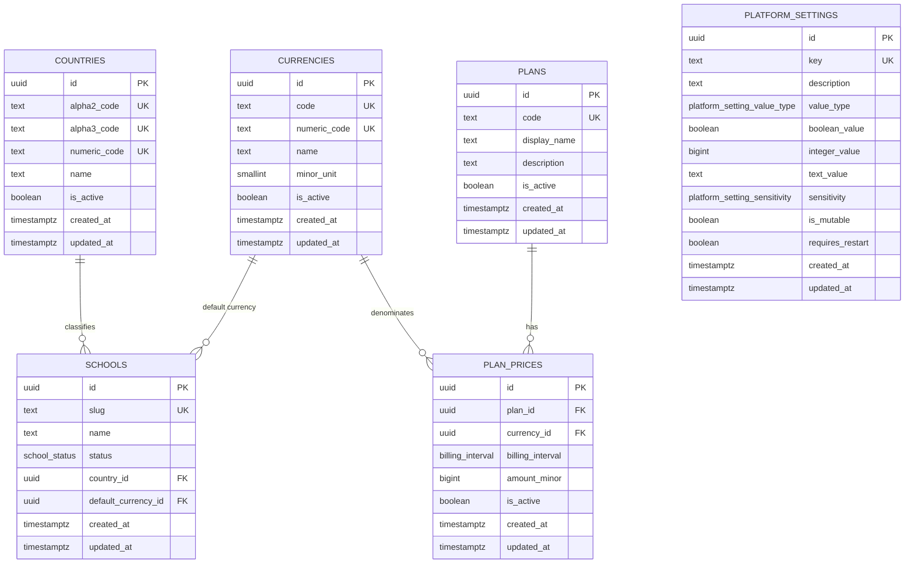

# Global data ERD

All entities in this diagram are platform-global tables in the `app` schema. They intentionally
contain no `school_id`, `tenant_id`, or organization discriminator. SAD section 10 is not available
in this repository; this classification follows the explicit ST-033 requirements.

`PLAN_PRICES` additionally has the business-key uniqueness constraint
`(plan_id, currency_id, billing_interval)`. Every foreign key uses `ON UPDATE RESTRICT` and
`ON DELETE RESTRICT`.
