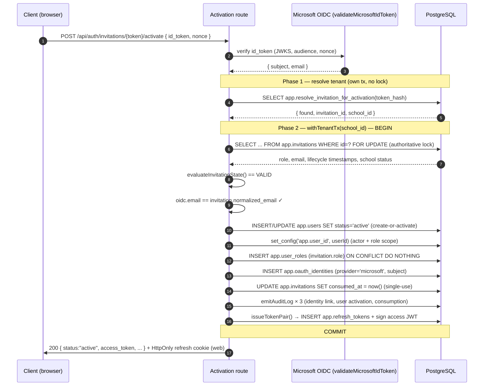
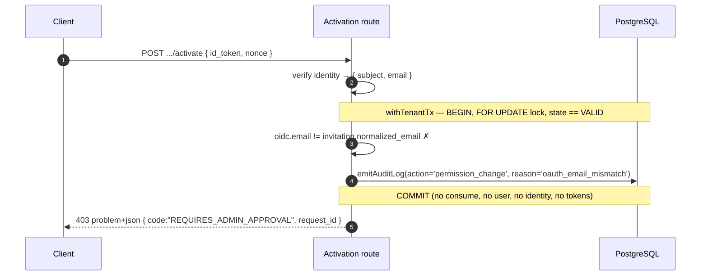

# Account Activation Sequence (ST-078)

`POST /api/auth/invitations/{token}/activate` completes onboarding for an invited user. It runs a
single atomic database transaction that consumes the invitation, provisions and activates the user,
grants the invited role, links the Microsoft OAuth identity, writes the audit trail, and issues the
first session token pair — all or nothing.

## Endpoint

- **Public** (no bearer session): the invitation token in the path is the credential, paired with a
  verified Microsoft OIDC identity in the body. Exempt from the JWT boundary
  (`middleware/jwtAuth.ts`) and from CSRF (`middleware/csrf.ts`) for the same reason as the
  session-refresh and webhook endpoints — it carries no ambient authority a cross-site page could
  forge.
- **Request:** `{ id_token, nonce }`. The ID token is verified against Microsoft's JWKS
  (`validateMicrosoftIdToken`, ST-077); the verifier is an injected seam so tests can run without a
  live IdP.
- **Errors:** RFC 9457 `application/problem+json` with a `request_id`, produced by the global error
  handler from the `CodedHttpException`s thrown below.

## Tenant resolution — the two-phase shape

The invitation token is not tenant-scoped, and `app.invitations` is `FORCE ROW LEVEL SECURITY`, so
the school must be resolved before a tenant transaction can exist (the same constraint
`rotateRefreshToken` works around). Phase 1 resolves `token_hash → (invitation_id, school_id)`
through the `SECURITY DEFINER` seam `app.resolve_invitation_for_activation` (migration 000033),
read-only and lock-free. Phase 2 opens the real tenant transaction and takes the authoritative
`FOR UPDATE` lock.

## Happy path (email matches)

## Email divergence (REQUIRES_ADMIN_APPROVAL)

When the OIDC email does not match the invitation's bound email, automatic activation is aborted. The
transaction records the anomaly and commits **only** the audit row — the invitation is deliberately
left unconsumed so an administrator can still resolve it, and nothing is granted.

## Concurrency & single-use guarantee

Every submission of one token contends on the `FOR UPDATE` lock taken as the first statement of
phase 2. The winner sets `consumed_at` and commits; every other attempt then acquires the lock,
re-reads a consumed row, and is rejected with `409 CONSUMED`. Because nothing is written before the
lock is held and the lifecycle re-validated, losing attempts roll back with zero side effects — no
orphaned `oauth_identities`, users, or sessions. The `uq_oauth_identities_provider_subject` and
`consumed_at` guards are backstops behind the lock, not the primary mechanism.

## Failure taxonomy

| Condition                                    | Response                                                    |
| -------------------------------------------- | ----------------------------------------------------------- |
| Malformed / unknown token                    | `400 INVITATION_INVALID`                                    |
| Expired / revoked / consumed / school off    | `409 EXPIRED` / `REVOKED` / `CONSUMED` / `SCHOOL_SUSPENDED` |
| OIDC email ≠ invitation email                | `403 REQUIRES_ADMIN_APPROVAL` (audit committed)             |
| Microsoft `subject` already linked elsewhere | `409 CONFLICT_DUPLICATE_ENTRY`                              |
| Success                                      | `200 { status:"active", ...token pair }`                    |
