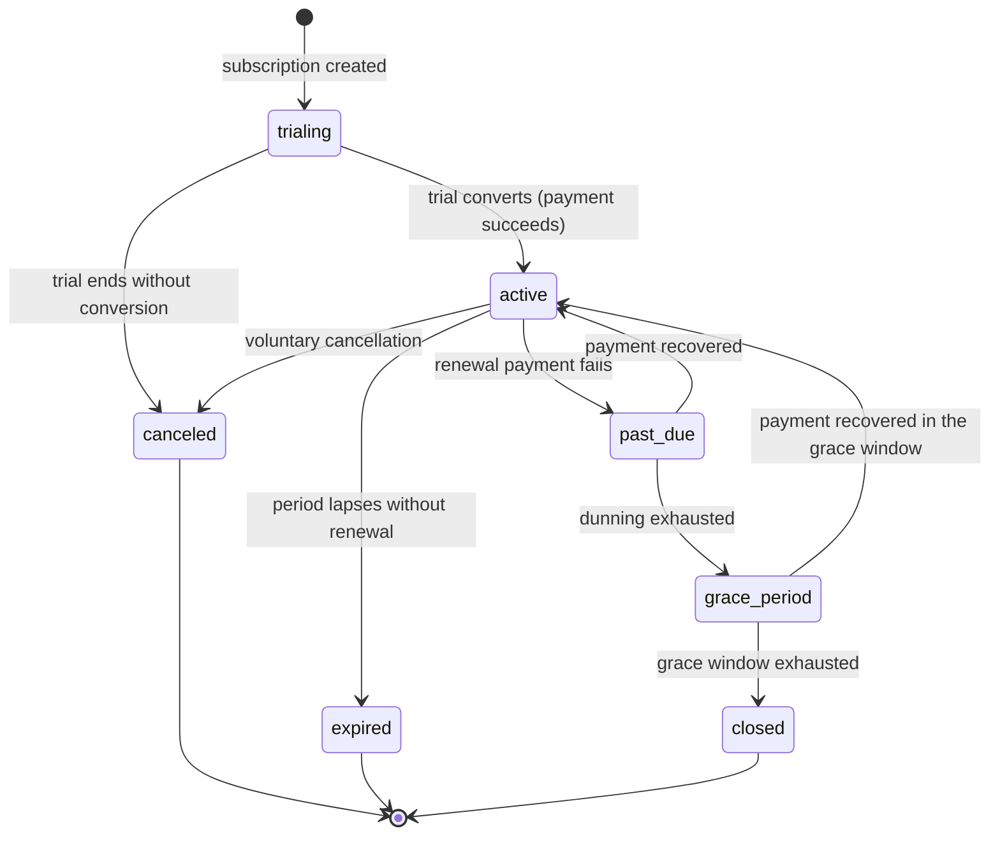

# Subscription and entitlement data model

Migration `000016_create_subscription_and_entitlement_tables.sql` adds three tables: the
school-owned `app.subscriptions` and `app.ai_subscriptions`, and the global `app.billing_events`.
SQL constraints are the source of truth; APIs must not weaken them or treat RLS as a substitute for
permission checks.

## What owns what

`app.subscriptions` and `app.ai_subscriptions` are **current-state** tables: one row per school (or
per student), updated in place as a payment provider's webhooks report renewals, plan changes,
cancellations, or lapses. Neither table is a history log -- that is exactly what `app.billing_events`
already is, so a school or student's subscription is never versioned as a new row per change. Keeping
one mutable row per tenant avoids the derived, duplicated-fact problem the
[normalization standard](./migration-policy.md#normalization-standard) warns about: the current
status is the current status, not something recomputed by scanning history at read time.

| Table              | Scope                     | Key columns                                                                        |
| ------------------ | ------------------------- | ---------------------------------------------------------------------------------- |
| `subscriptions`    | One row per school        | `plan_id`, `status`, `current_period_start`, `current_period_end`                  |
| `ai_subscriptions` | One row per student       | `status`, `current_period_start`, `current_period_end`                             |
| `billing_events`   | Global, mutable per event | `provider`, `provider_event_id`, `event_type`, `effective_at`, `status`, `payload` |

> **Amended by ST-132.** `billing_events` was append-only when 000016 created it, because it only
> ever recorded "seen it". Processing an event introduced retries, and
> [`000078_normalize_billing_events.sql`](../../db/migrations/000078_normalize_billing_events.sql)
> made the row mutable in place: `status`, `processed_at`, `attempt_count` and `last_error` change
> across attempts, while `(provider, provider_event_id)` stays the identity — because that unique
> constraint _is_ the deduplication guarantee, and a row-per-attempt model would have to give it up.
> `DELETE` is still withheld.

`ai_subscriptions` carries no `plan_id`. It is a single AI-feature entitlement toggle scoped to one
student, not a school-plan choice -- the ticket's own description distinguishes the two tables by
exactly this ("school-level: plan, status, period" versus "student-level, status, requires school
link"). A plan reference was not invented to make the tables symmetric.

## Subscription state machine

Both `subscriptions.status` and `ai_subscriptions.status` share one enum, `app.subscription_status`,
since both are the same lifecycle shape at different scopes:

`trialing`, `active`, `past_due` and `grace_period` are the live states in which the school or
student retains access; `canceled`, `expired` and `closed` are terminal and have no outgoing edges.
Every transition is an `UPDATE` of the existing row driven by a processed `billing_events` row -- the
events table is the durable evidence of _why_ a transition happened; the subscription row only ever
reflects _what_ the current state is.

`grace_period` and `closed` were added by 000042 (ST-092) after this diagram was first written.
The full transition tables for both subscription types, the Stripe event vocabulary they are driven
by, the school→AI cascade, and what happens to an event that maps to no legal transition are in
**[stripe-webhook-state-machine.md](./stripe-webhook-state-machine.md)** (ST-132). This diagram is
the summary; that document is the specification.

## Keys and functional dependencies

- `subscriptions`: primary key `id`; candidate key `school_id` (one current subscription per
  school). `id` determines the plan, status, and period; `school_id` determines `id` 1:1.
- `ai_subscriptions`: primary key `id`; candidate key `(school_id, student_id)` (one current AI
  entitlement per student). `id` determines the status and period.
- `billing_events`: primary key `id`; candidate key `(provider, provider_event_id)`, the natural key
  a payment provider itself guarantees is unique per account/webhook endpoint -- not
  `provider_event_id` alone, since two different providers are not guaranteed to draw event ids from
  the same namespace.

All values are atomic (1NF). Neither school-scoped table has a composite primary key, so 2NF is
trivial. Plan facts stay on `app.plans`; student facts stay on `app.students`; `subscriptions` and
`ai_subscriptions` reference them by foreign key rather than copying plan names or student details
(3NF).

## Why `billing_events` has no `school_id`

A webhook delivery must be deduplicated by `(provider, provider_event_id)` before its payload is
parsed enough to know which school or student it concerns. Requiring a `NOT NULL school_id` would
make that dedup step depend on interpretation it hasn't done yet, and `app.apply_tenant_isolation`
already refuses any table without one. `billing_events` therefore stays a global table and does not
carry a foreign key toward either new table added here -- the application resolves which
subscription or ai_subscription a processed event affects from the payload itself, the same way
`erpnext_id_mappings` in `000015_create_finance_cache_tables.sql` resolves identity from its own
crosswalk rather than a rigid foreign key.

## RLS and grants

`subscriptions` and `ai_subscriptions` follow this repo's uniform tenant treatment: owned by
`studafy_admin`, granted CRUD to `studafy_app`, revoked from `PUBLIC`, and carrying the canonical
`FOR ALL TO PUBLIC` `tenant_isolation` policy via `app.apply_tenant_isolation`, with RLS enabled and
forced.

`billing_events` is different -- **global-admin scoped** -- because unlike the six pre-existing
global tables (`schools`, `plans`, `plan_prices`, `countries`, `currencies`, `platform_settings`,
all classified in `db/policies/tenant_isolation.sql`), it carries externally-sourced payment-provider
payloads rather than mostly-public reference data:

- The default CRUD grant `studafy_app` would otherwise receive by
  `ALTER DEFAULT PRIVILEGES FOR ROLE studafy_admin IN SCHEMA app` (`000002`) is explicitly revoked,
  the same way `000004` narrowed access for the six existing global tables.
- RLS is enabled and **forced** (this repo's uniform posture for every RLS-bearing table), with one
  policy, `global_admin_only`, naming `studafy_admin` explicitly rather than `PUBLIC`. Access
  therefore depends on both the grant and the policy, not either alone -- the same defense-in-depth
  reasoning `000002` gives for revoking `PUBLIC`'s schema/database defaults that were already absent.
- There is still no `BYPASSRLS` role anywhere in this schema
  (`db/migrations/000002_create_database_roles_and_grants.sql`); processing an inbound webhook is a
  controlled-maintenance write performed under `studafy_admin`, the same role migrations already use,
  not a new role. `docs/database/role-model.md` deliberately keeps to exactly two roles.

## Index rationale

- `uq_subscriptions_school`, `uq_ai_subscriptions_school_student`, and
  `uq_billing_events_provider_event_id` cover the one-current-row-per-tenant and dedup lookups
  respectively, and each already leads with (or is) the foreign key column(s) that need it.
- `idx_subscriptions_plan_id`: backs `plan_id`'s parent update/delete check, matching the precedent
  `idx_plan_prices_currency_id` sets in `000004` for a tenant/global-reference column with no other
  query need yet.
- No additional index is added to `ai_subscriptions` or `billing_events`: their unique constraints
  already cover every foreign key and the one documented access pattern each table has today. Adding
  more would be speculative.

## Known gaps

Not built here, and deliberately out of scope for this migration:

- No subscription history/versioning table. `app.billing_events` is the durable event history;
  duplicating it as a second, row-per-change subscription ledger would drift from it. If a future
  requirement needs "what was this school's plan on date X," it is answered by replaying
  `billing_events`, not by a new table.
- No webhook signature verification, retry/backoff, or processing-status column on `billing_events`.
  This migration is the dedup and storage layer only; verifying and processing a delivery is
  application/worker logic, the same restraint `000015` documents for `finance_sync_outbox`'s
  retry fields.
- No `plan_id` on `ai_subscriptions` and no AI-specific plan/price table. The ticket describes a
  single per-student entitlement, not a priced AI plan catalog; nothing in this repository's ADRs or
  existing plan model asks for one yet.
