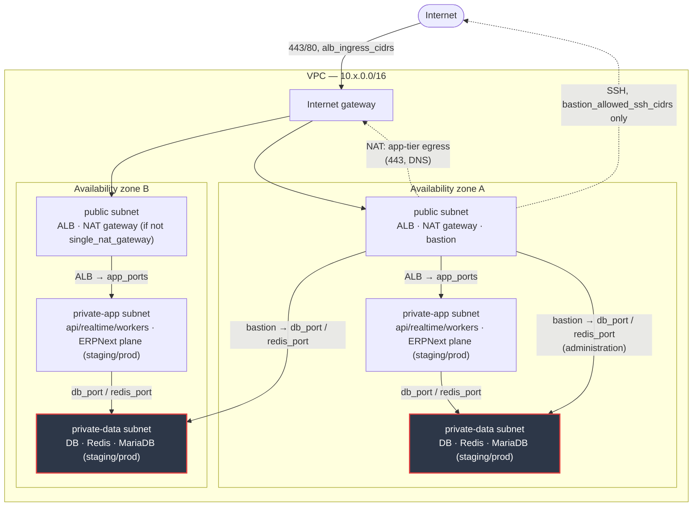

# Network diagram

Source: `infra/terraform/modules/network`. One VPC per environment, three subnet tiers, one of
each tier per availability zone. This diagram shows a 2-AZ environment (dev/staging); prod uses
3 AZs and a NAT gateway per AZ instead of one shared gateway — see
[Environment differences](#environment-differences).



`private-data` subnets (red outline) have no route out of the VPC at all — not through NAT,
not through the internet gateway. That is what makes DB/Redis unreachable from the public
internet: routing enforces it, and security groups enforce it a second time.

## Security group boundaries

```
                 ┌────────────┐
  internet ─────►│    alb     │──── 80/443 from alb_ingress_cidrs
                 └─────┬──────┘
                        │ app_ports
                        ▼
                 ┌────────────┐
                 │    app     │──── 443 to app_egress_cidr_blocks, DNS to VPC resolver
                 └──┬──────┬──┘
        db_port │           │ redis_port
                 ▼           ▼
          ┌──────────┐ ┌──────────┐
          │    db    │ │  redis   │   no egress rules on either — nothing leaves
          └────▲─────┘ └────▲─────┘
               │ db_port    │ redis_port
               │            │
          ┌────┴────────────┴───┐
          │       bastion       │◄── 22 from bastion_allowed_ssh_cidrs only
          └──────────────────────┘
```

Only `alb` accepts traffic from the internet. Every other group accepts traffic only from a
named security group in this diagram — never from a CIDR block (except the bastion's SSH
ingress, which is a CIDR allowlist by necessity, and DNS/HTTPS egress rules, which target the
VPC resolver or `app_egress_cidr_blocks`).

**staging/prod only** (the ERPNext plane, `local.erpnext_plane_enabled` in `infra/terraform/main.tf`):
two more groups follow the identical rule — `erpnext`'s only ingress source is `app` (apps/api is
the ERPNext plane's integration gateway, not the ALB and not the internet), and `mariadb`'s only
ingress sources are `erpnext` and the bastion. Full diagram:
[`infra/terraform/modules/network/README.md`](../../infra/terraform/modules/network/README.md#security-groups).

## CIDR allocation

Subnet CIDRs are derived from `vpc_cidr` via `cidrsubnet(vpc_cidr, 4, n)` — a `/16` splits into
sixteen `/20` blocks. Only the first `3 * az_count` are used; the remainder is headroom.

| Tier           | Block index (`n`)   | Example (`vpc_cidr = 10.0.0.0/16`, `az_count = 2`) |
| -------------- | ------------------- | -------------------------------------------------- |
| `public`       | `0 .. az_count-1`   | `10.0.0.0/20`, `10.0.16.0/20`                      |
| `private-app`  | `4 .. 4+az_count-1` | `10.0.64.0/20`, `10.0.80.0/20`                     |
| `private-data` | `8 .. 8+az_count-1` | `10.0.128.0/20`, `10.0.144.0/20`                   |

## Environment differences

| Environment | `vpc_cidr`    | `az_count` | `single_nat_gateway`                                          |
| ----------- | ------------- | ---------- | ------------------------------------------------------------- |
| dev         | `10.0.0.0/16` | 2          | `true` (cost over HA)                                         |
| staging     | `10.1.0.0/16` | 2          | `true` (cost over HA)                                         |
| prod        | `10.2.0.0/16` | 3          | `false` (one NAT gateway per AZ — no single point of failure) |

The three VPCs use non-overlapping `/16` blocks so they can be peered later without
renumbering — see `infra/terraform/variables.tf`.

## Audit trails

Two independent logs back the "unreachable from the internet" and "bastion access logged"
acceptance criteria:

- **VPC flow logs** (`enable_flow_logs`, default on) — every accepted/rejected packet at the
  VPC boundary, in CloudWatch Logs at `/<name_prefix>/vpc/flow-logs`.
- **Bastion SSH log** — the CloudWatch agent ships `/var/log/secure` from the bastion to
  `/<name_prefix>/bastion/ssh`. Every login attempt, successful or not, is captured off-box.

See `infra/terraform/modules/network/README.md` for the full input/output reference.
